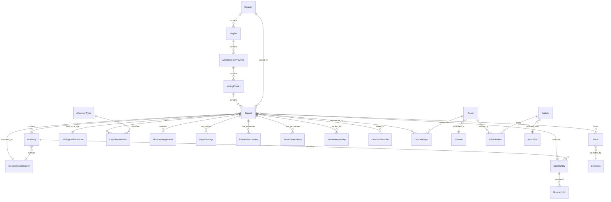

# Copper Atlas — Database Architecture

> 全球铜矿床图谱 — 数据库架构
> Version 2.0 · Phase 2 ER Model Redesign

---

## Entity-Relationship Diagram



---

## Table Design — Phase 2 Target Schema

### Tier 1 — Spatial Hierarchy (geographic containment)

#### `regions`
Geographic regions within a country (first-level geological subdivision).

| Column | Type | Notes |
|--------|------|-------|
| id | UUID PK | |
| name_en | VARCHAR(200) | e.g. "Antofagasta Region" |
| name_zh | VARCHAR(200) | |
| country_id | UUID FK→countries | |
| geom | GEOMETRY(Polygon,4326) | Regional boundary |
| parent_region_id | UUID FK→regions | For hierarchical regions |

**Relationship**: Country 1→N Region 1→N MetallogenicProvince

#### `metallogenic_provinces`
Geological provinces defined by shared metallogenic history.

| Column | Type | Notes |
|--------|------|-------|
| id | UUID PK | |
| name_en | VARCHAR(300) | e.g. "Central Andean Porphyry Belt" |
| name_zh | VARCHAR(300) | |
| region_id | UUID FK→regions | |
| geom | GEOMETRY(Polygon,4326) | Province outline |
| age_range | NUMRANGE | Mineralization age range in Ma |
| tectonic_setting | VARCHAR(300) | |
| primary_commodities | TEXT[] | |
| description_en | TEXT | |

#### `mining_districts`
Local mining areas containing multiple deposits.

| Column | Type | Notes |
|--------|------|-------|
| id | UUID PK | |
| name_en | VARCHAR(300) | e.g. "Chuquicamata District" |
| name_zh | VARCHAR(300) | |
| province_id | UUID FK→metallogenic_provinces | |
| geom | GEOMETRY(Polygon,4326) | District boundary |
| deposit_count | INTEGER | Cached count |
| total_tonnage_mt | NUMERIC(12,3) | Cached sum |

---

### Tier 2 — Core Geology (expanded deposit model)

#### `deposits` (existing, expanded)
The central entity. Mineral-agnostic. Phase 2 additions marked with ⭐.

*Added fields beyond Phase 1*:
- ⭐ `region_id` UUID FK→regions
- ⭐ `metallogenic_province_id` UUID FK→metallogenic_provinces
- ⭐ `mining_district_id` UUID FK→mining_districts
- ⭐ `tonnage_ore_mt` NUMERIC(12,3) — ore tonnage (total rock)
- ⭐ `data_license` VARCHAR(100) — source data license
- ⭐ `retrieved_date` DATE — when data was acquired
- ⭐ `verification_status` VARCHAR(30) — raw/pending/verified/disputed

#### `ore_bodies` ⭐ NEW
Individual ore bodies within a deposit.

| Column | Type | Notes |
|--------|------|-------|
| id | UUID PK | |
| deposit_id | UUID FK→deposits | |
| name | VARCHAR(300) | e.g. "Rosario Orebody" |
| classification_id | UUID FK→deposit_classification | Sub-type |
| tonnage_mt | NUMERIC(12,3) | |
| grade_pct | NUMERIC(6,3) | |
| geometry_3d | GEOMETRY | 3D orebody shape (future) |
| depth_from_m | NUMERIC(8,1) | Top depth |
| depth_to_m | NUMERIC(8,1) | Bottom depth |

**Relationship**: Deposit 1→N OreBody

#### `mines` ⭐ NEW
Mining operations at a deposit. A deposit can have multiple mines over time.

| Column | Type | Notes |
|--------|------|-------|
| id | UUID PK | |
| deposit_id | UUID FK→deposits | |
| name | VARCHAR(300) | e.g. "Chuquicamata Open Pit" |
| type | VARCHAR(50) | open_pit / underground / block_caving |
| status | VARCHAR(30) | |
| start_year | SMALLINT | |
| end_year | SMALLINT | |
| current_depth_m | NUMERIC(8,1) | |
| operator_company_id | UUID FK→companies | |

**Relationship**: Deposit 1→N Mine. Mine N→1 Company.

#### `commodities` ⭐ NEW TABLE (replaces mineral_i18n lookup)
Mineral/commodity registry with metadata.

| Column | Type | Notes |
|--------|------|-------|
| id | UUID PK | |
| code | VARCHAR(30) UNIQUE | `copper`, `gold` |
| name_en | VARCHAR(200) | |
| name_zh | VARCHAR(200) | |
| chemical_symbol | VARCHAR(10) | `Cu`, `Au` |
| group_name | VARCHAR(100) | Base Metals, Precious, Battery |
| color_hex | CHAR(7) | Map display color |
| sort_order | SMALLINT | |
| is_enabled | BOOLEAN | Feature flag |
| phase | SMALLINT | Rollout phase |

#### `deposit_commodities` ⭐ NEW (M2M junction)
| Column | Type | Notes |
|--------|------|-------|
| deposit_id | UUID PK FK | |
| commodity_id | UUID PK FK | |
| role | VARCHAR(20) | primary / secondary / byproduct |

---

### Tier 3 — Academic & Reference Data

#### `companies` ⭐ NEW
Mining and exploration companies.

| Column | Type | Notes |
|--------|------|-------|
| id | UUID PK | |
| name | VARCHAR(300) | |
| ticker | VARCHAR(20) | Stock ticker |
| exchange | VARCHAR(50) | |
| headquarters_country_id | UUID FK→countries | |
| website | TEXT | |
| is_active | BOOLEAN | |

#### `papers` ⭐ NEW
Academic papers and technical reports.

| Column | Type | Notes |
|--------|------|-------|
| id | UUID PK | |
| title | TEXT | |
| doi | VARCHAR(100) UNIQUE | |
| journal_id | UUID FK→journals | |
| publication_year | SMALLINT | |
| volume | VARCHAR(20) | |
| pages | VARCHAR(20) | |
| abstract | TEXT | |
| keywords | TEXT[] | |
| citation_count | INTEGER | Auto-updated |
| open_access | BOOLEAN | |

#### `journals` ⭐ NEW
| Column | Type | Notes |
|--------|------|-------|
| id | UUID PK | |
| name | VARCHAR(300) | e.g. "Economic Geology" |
| publisher | VARCHAR(200) | |
| issn | VARCHAR(20) | |
| impact_factor | NUMERIC(4,3) | |

#### `authors` ⭐ NEW
| Column | Type | Notes |
|--------|------|-------|
| id | UUID PK | |
| name | VARCHAR(200) | |
| orcid | VARCHAR(19) UNIQUE | |
| institution_id | UUID FK→institutions | |
| email | VARCHAR(200) | |

#### `institutions` ⭐ NEW
| Column | Type | Notes |
|--------|------|-------|
| id | UUID PK | |
| name | VARCHAR(300) | e.g. "MIT" |
| ror_id | VARCHAR(20) UNIQUE | |
| country_id | UUID FK→countries | |

#### `paper_authors` ⭐ NEW (M2M)
| Column | Type | Notes |
|--------|------|-------|
| paper_id | UUID PK FK | |
| author_id | UUID PK FK | |
| author_order | SMALLINT | 1=first author |

#### `deposit_papers` ⭐ NEW (M2M)
| Column | Type | Notes |
|--------|------|-------|
| deposit_id | UUID PK FK | |
| paper_id | UUID PK FK | |
| relevance | VARCHAR(20) | primary_source / citation / regional |

---

### Tier 4 — Media

#### `deposit_images` ⭐ REPLACES images TEXT[] array
| Column | Type | Notes |
|--------|------|-------|
| id | UUID PK | |
| deposit_id | UUID FK→deposits | |
| url | TEXT | |
| caption_en | TEXT | |
| caption_zh | TEXT | |
| image_type | VARCHAR(50) | map / ore / thin_section / satellite / field / mine |
| credit | VARCHAR(300) | Photographer/rights holder |
| license | VARCHAR(100) | CC-BY-4.0 / All Rights Reserved |
| is_primary | BOOLEAN | Primary display image |

---

### Tier 5 — AI & Knowledge Graph

#### `ai_analyses` ⭐ NEW (Phase 3)
| Column | Type | Notes |
|--------|------|-------|
| id | UUID PK | |
| deposit_id | UUID FK→deposits | |
| model | VARCHAR(100) | GPT-4o / Claude / custom |
| model_version | VARCHAR(50) | |
| summary_en | TEXT | AI-generated summary |
| summary_zh | TEXT | |
| keywords | TEXT[] | Extracted keywords |
| embedding | VECTOR(1536) | pgvector embedding for similarity search |
| confidence | NUMERIC(4,3) | AI confidence score |
| human_reviewed | BOOLEAN | Has a human verified this? |
| reviewer_id | UUID | Who reviewed it |
| created_at | TIMESTAMPTZ | |
| prompt_used | TEXT | Reproducibility |

#### `similar_deposits` ⭐ NEW (Phase 3)
| Column | Type | Notes |
|--------|------|-------|
| deposit_a_id | UUID PK FK | |
| deposit_b_id | UUID PK FK | |
| similarity_score | NUMERIC(5,4) | Cosine similarity of embeddings |
| method | VARCHAR(50) | embedding / mineral / geology / combined |

---

## JSONB vs. Separate Tables — Decision Framework

| Data Characteristic | Use JSONB | Use Separate Table |
|---------------------|-----------|-------------------|
| Few rows per deposit (<5) | ✅ | |
| Variable schema per mineral | ✅ | |
| Rarely queried/filtered | ✅ | |
| Simple key-value pairs | ✅ | |
| Many rows per deposit (>10) | | ✅ |
| Need foreign key constraints | | ✅ |
| Frequently filtered/joined | | ✅ |
| Need to enforce uniqueness | | ✅ |
| Need referential integrity | | ✅ |

**Examples**:
- `properties` JSONB: copper-specific fields (supergene_enrichment, oxide_zone_depth)
- Separate table: `resource_estimates` (many estimates per deposit, need FK to reporting standard)
- Separate table: `deposit_images` (many images, need license tracking, need FK)

---

## Indexing Strategy (Phase 2)

```sql
-- Spatial indexes (GiST) — critical for map queries
CREATE INDEX ON deposits USING GIST (location);
CREATE INDEX ON regions USING GIST (geom);
CREATE INDEX ON metallogenic_provinces USING GIST (geom);
CREATE INDEX ON mining_districts USING GIST (geom);

-- Foreign key indexes
CREATE INDEX ON deposits (country_id);
CREATE INDEX ON deposits (deposit_classification_id);
CREATE INDEX ON deposits (metallogenic_province_id);
CREATE INDEX ON deposits (mining_district_id);
CREATE INDEX ON ore_bodies (deposit_id);
CREATE INDEX ON mines (deposit_id);

-- Composite indexes for common queries
CREATE INDEX ON deposits (primary_mineral, status);
CREATE INDEX ON deposits (country_id, primary_mineral);
CREATE INDEX ON deposits (tonnage_mt) WHERE tonnage_mt IS NOT NULL;

-- Full-text search
CREATE INDEX ON deposits USING GIN (
    to_tsvector('english', coalesce(name,'') || ' ' || coalesce(summary_en,''))
);

-- pgvector (Phase 3)
CREATE INDEX ON ai_analyses USING ivfflat (embedding vector_cosine_ops);
```

---

## Migration Plan (Phase 1 → Phase 2)

1. **Non-breaking**: Add new tables (`regions`, `companies`, `papers`, etc.) — no impact on existing data
2. **Non-breaking**: Add new columns to `deposits` (`region_id`, `metallogenic_province_id`, etc.) — NULLable
3. **Breaking (deferred to Phase 3)**: Replace `images TEXT[]` with `deposit_images` table — keep both, deprecate array
4. **Data migration**: Populate new tables from existing JSONB `properties` field and external sources
5. **Zero downtime**: All migrations use `ALTER TABLE ... ADD COLUMN` with `DEFAULT NULL`, no table locks

**Guarantee**: No data is lost during migration. All Phase 1 queries continue to work.
